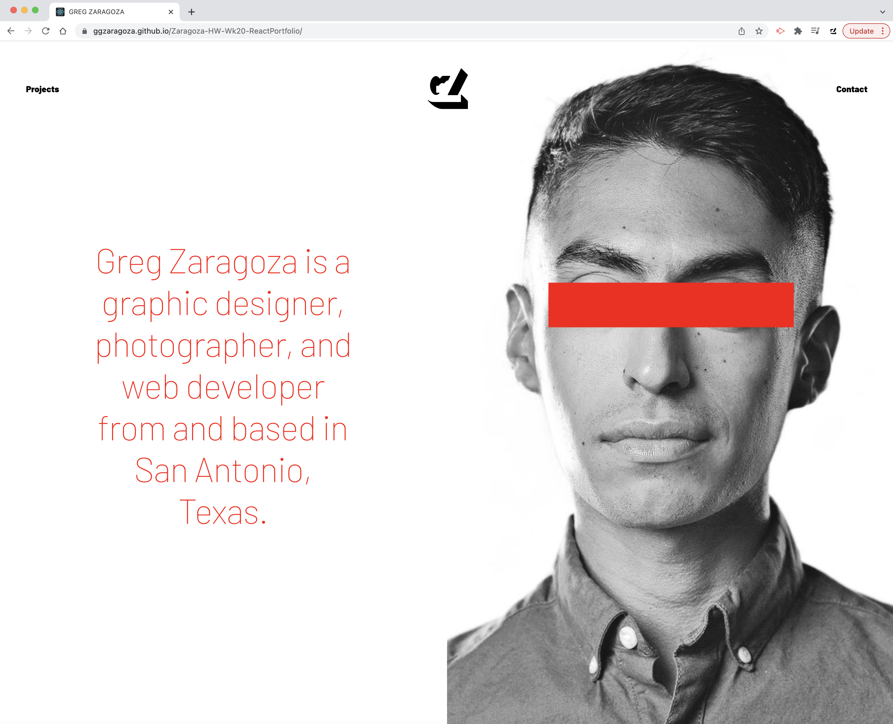

# Zaragoza-HW-Wk20-ReactPortfolio

In this repository you will a portfolio page in development built using React. The deployed page featured here is a re-configuration of a previously deployed portfolio page, hosted at the following repository: <a href="https://github.com/ggzaragoza/Zaragoza-HW-Wk2-PortfolioPage">https://github.com/ggzaragoza/Zaragoza-HW-Wk2-PortfolioPage</a>.

All of the features of the previous version of this portfolio application have been refactored and rebuilt into corresponding React components, and CSS employs extensive styling and use of Flexbox to structure as a clean and organized application, and queries serve to reconfigure at breakpoint widths of 1920px, 1536px, 1366px, 1024px, and 828px.

Future updates will include links to pages with detailed descriptions and galleries for each individually featured project, as this deployed application essentially only functions as a landing page momentarily. Also under consideration is an additional "contact" page with a message form where visitors can submit inquiries and other concerns directly.

Deployed application: <a href="https://ggzaragoza.github.io/Zaragoza-HW-Wk20-ReactPortfolio/">https://ggzaragoza.github.io/Zaragoza-HW-Wk20-ReactPortfolio/</a>
